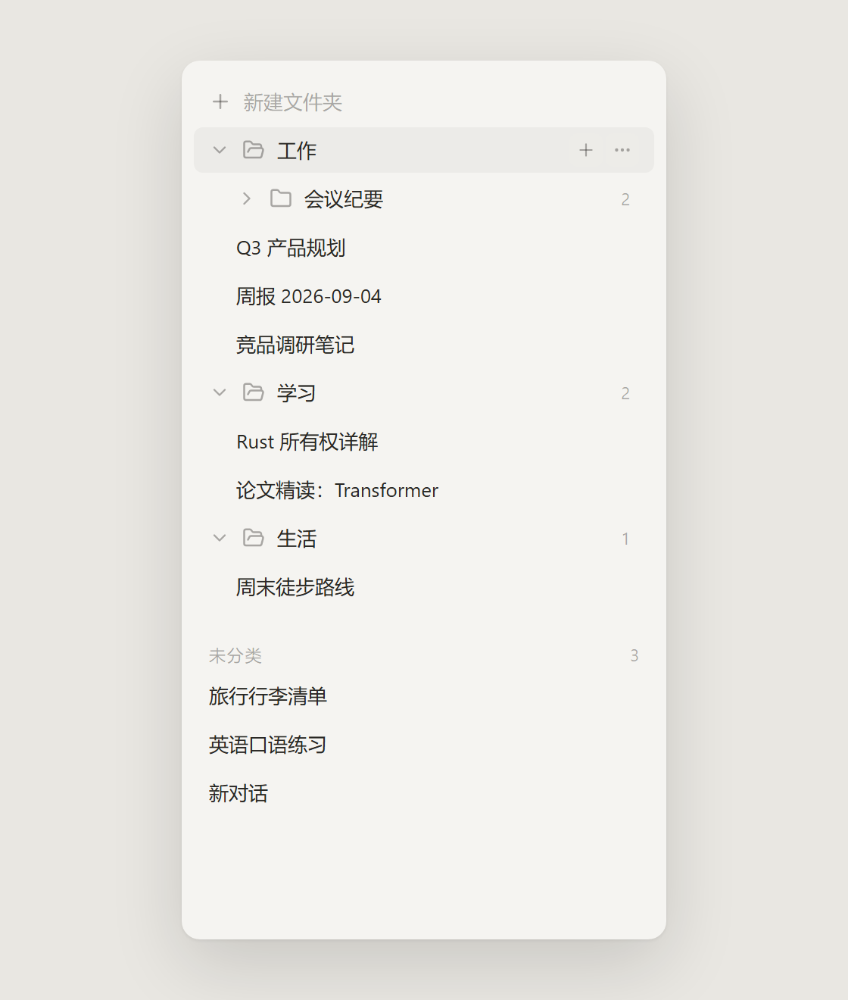
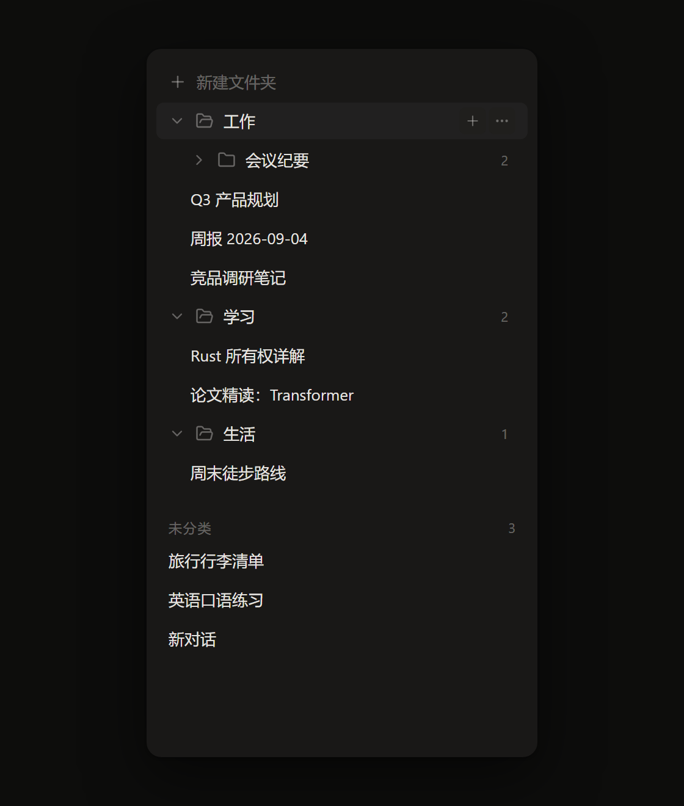
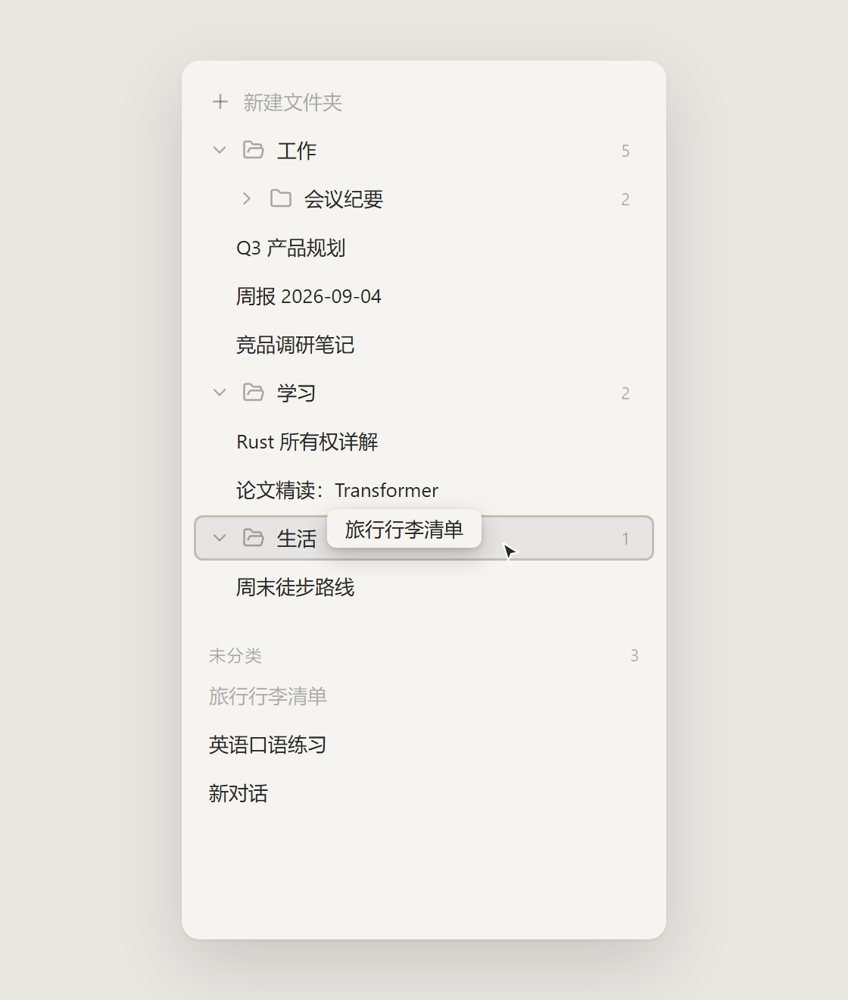
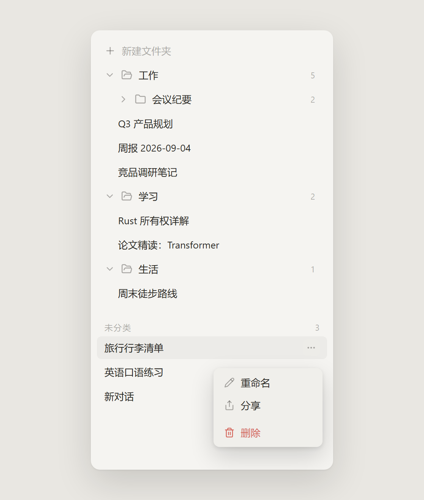

# DeepSeek 对话文件夹管理（浏览器扩展）

为 DeepSeek 网页版（https://chat.deepseek.com）侧边栏对话记录提供 **文件夹分类管理、自定义重命名、拖拽归类与排序** 增强的 Edge/Chrome 扩展（Manifest V3）。

## 功能特性

- **文件夹管理**：新建、行内重命名、删除（确认弹窗，删除后组内对话自动回到「未分类」）、展开/折叠且折叠状态持久化
- **文件夹嵌套**：支持将文件夹拖拽为另一文件夹的**子级**（无限层级）；文件夹头部悬停可「新建子文件夹」；删除父文件夹时其全部子树一并删除、对话回到「未分类」（确认框会提示子文件夹与对话数量）
- **拖拽交互**：对话拖入文件夹（展开的列表直接放入；折叠的文件夹可拖到头部，悬停 600ms 自动展开）、拖出回未分类、文件夹之间跨层拖拽排序/归级；拖拽过程有 ghost 预览、目标高亮脉冲等视觉反馈
- **数据获取**：MAIN world 拦截 `fetch`/`XHR` 会话接口（`/api/v0/chat_session/*`）为主；解析失败时自动降级为从隐藏的原生 DOM 中提取（MutationObserver 兜底）
- **原生交互兼容**：点击对话卡片转发原生 `<a>` 点击，保证 SPA 路由与内部加载逻辑完整执行；原生重命名/删除对话后通过接口拦截 + DOM 监听双向同步；删除对话优先走 DeepSeek 原生确认框（拦截器回传自动同步），原生入口不可用时降级为扩展自绘确认框
- **主题融合（宿主对齐）**：Shadow DOM 样式完全隔离；颜色 / 字体 / 字号 / 行高 / 圆角在挂载与主题切换时从原生侧边栏实时提取，hover / active 等交互色由基准令牌 `color-mix` 派生——扩展 UI 随 DeepSeek 换肤自动跟随；提取失败回退内置暖灰色板
- **全键盘可达**：对话行 / 文件夹头支持 Tab + Enter/Space；更多菜单支持 ↑/↓ 导航与 Esc 关闭（焦点归还触发按钮）；确认弹窗打开即聚焦「取消」，Esc 取消、Tab 圈定
- **操作反馈**：拖放目标有中性高亮反馈（非蓝色）；重命名 / 删除等异步操作有 pending 态；接口失败保留原状可重试（不静默改本地）；Toast 出现在侧边栏区域内底部居中
- **持久化**：文件夹结构、`chatId ↔ folderId` 映射、未分类顺序均存储于 `chrome.storage.local`，多标签页自动同步

## 界面预览

> 以下为按扩展实际样式（宿主对齐设计令牌）绘制的功能示意图。

<p align="center">
  
  
</p>
<p align="center"><sub>浅色 / 深色主题自动跟随宿主换肤 —— 文件夹嵌套、子树对话计数徽标、悬停操作</sub></p>

<p align="center">
  
  
</p>
<p align="center"><sub>拖拽归类（放置目标中性高亮，折叠文件夹悬停 600ms 自动展开）与「更多」操作菜单</sub></p>

## 技术栈

Vue 3 (`<script setup>`) + TypeScript + Pinia + vuedraggable@next + Tailwind CSS v3（关闭 preflight，`?inline` 注入 Shadow Root）+ Vite 5 + @crxjs/vite-plugin

## 目录结构

```
src/
├── types/index.ts              # ChatSession / Folder / StorageSchema / 桥消息类型
├── inject/
│   ├── interceptor.ts          # 拦截器实现（自包含）：劫持 fetch/XHR 解析会话接口、
│   │                           # 捕获鉴权 token、代发删除/重命名/分享请求
│   └── inpage.ts               # MAIN world 入口：CSP 兜底，异步安装拦截器
├── content/
│   ├── inject-bootstrap.ts     # document_start 同步注入拦截器到 MAIN world
│   └── main.ts                 # ISOLATED 入口：Shadow DOM 挂载、监听接线、自愈
├── utils/
│   ├── storage.ts              # chrome.storage.local 封装（schema 校验、去抖写、变更订阅）
│   ├── bridge.ts               # postMessage 消息桥（来源 + 类型白名单校验）
│   ├── native-api.ts           # 原生 API 主动请求（删除/重命名/分享）双路径封装
│   ├── native-dom.ts           # 原生列表定位/隐藏、DOM 兜底提取、点击转发、主题检测
│   ├── dnd.ts                  # 拖拽类型过滤（data-dsf-kind，防跨组模型污染）
│   └── debug.ts                # 调试日志开关（默认静默，localStorage 标志开启）
├── stores/
│   ├── chat.ts                 # 会话 Map、upsert/重命名/删除同步
│   └── folder.ts               # 文件夹 CRUD、映射、折叠态、排序、持久化
└── sidebar/
    ├── App.vue                 # 根组件：新建按钮、文件夹排序、未分类列表、删除走原生确认
    ├── components/
    │   ├── FolderItem.vue      # 文件夹：折叠/重命名/行内删除确认态/头部放置目标/组内拖拽
    │   └── ChatItem.vue        # 对话卡片：点击跳转、拖拽数据携带
    ├── icons.ts                # lucide 线条图标系统（统一描边规范）
    └── styles/main.css         # Tailwind 入口 + 主题变量 + 滚动条/拖拽态/微动效
```

## 隐私与权限

本扩展**不收集、不上传任何数据**，所有数据仅保存在你的浏览器本地。

### 权限说明（Manifest V3，最小化申请）

| 权限 | 用途 |
|---|---|
| `storage` | 将文件夹结构与对话归类关系保存到 `chrome.storage.local`（本机） |
| `*://chat.deepseek.com/*` | 仅在 DeepSeek 网页版注入内容脚本，替换侧边栏对话列表 |

不申请 tabs、scripting、webRequest、downloads、历史记录等任何其他权限；不加载任何远程代码（全部依赖打包在扩展内）。

### 敏感行为透明声明

为在扩展侧边栏中展示你的对话列表，本扩展会：

1. **拦截页面自身的网络请求**：在 `chat.deepseek.com` 页面内临时包装 `window.fetch` / `XMLHttpRequest`，仅捕获 `/api/v0/chat_session/*` 相关请求的**响应**用于解析会话标题与列表——数据全程留在当前页面内存中，不发送到任何第三方服务器；
2. **读取请求头中的登录凭证（Authorization Token）**：仅用于在你主动执行删除/重命名/分享时，以你的身份向 DeepSeek 官方接口发起与网页端完全相同的请求。Token 只存在于页面内存，不写入存储、不输出到日志、不离开浏览器；
3. **本地存储**：仅保存文件夹名称、`chatId ↔ 文件夹` 映射与排序（`chrome.storage.local`）。**不存储任何对话内容**。卸载扩展即彻底清除；
4. **控制台输出**：默认**不在控制台输出任何日志**（包括对话标题等页面内容）；仅当你按「常见问题」中的方式显式开启调试日志后，才会输出排障信息。

### 已知架构限制

内容脚本与页面之间的 postMessage 消息桥使用来源标识 + 类型白名单校验，但与所有同类扩展一样，无法防御 DeepSeek 页面自身脚本的伪造行为（页面脚本本就与扩展拦截器处于同一执行环境、具备同等能力），该限制不构成额外权限提升。

## 构建与加载

```bash
npm install
npm run build      # 产物输出到 dist/
# 或开发模式（HMR）：
npm run dev
```

加载到 Edge：

1. 打开 `edge://extensions`（Chrome 为 `chrome://extensions`）
2. 开启左下角「开发人员模式」
3. 点击「加载解压缩的扩展」，选择本项目的 `dist/` 目录
4. 访问 https://chat.deepseek.com 并登录，侧边栏原生对话列表将被增强版替换

> 开发模式（`npm run dev`）下需加载 `dist/` 并保持 dev server 运行。

## 实测验证清单

- [ ] 侧边栏顶部出现「新建文件夹」虚线按钮，原生对话列表被增强列表替换
- [ ] 扩展列表的背景 / 文字 / hover 底色与原生侧边栏并排对比无割裂感（DevTools 查看 `.dsf-root` 内联变量已被宿主提取值覆盖）
- [ ] 切换 DeepSeek 明暗主题，扩展列表即时跟随且颜色正确（暗色下输入框聚焦下划线为亮蓝而非深蓝）
- [ ] 新建文件夹后自动进入行内重命名；Enter/失焦提交，Esc 取消；**Esc 取消新建不残留「新建文件夹」空壳**
- [ ] 拖拽未分类对话到文件夹（展开态放入列表 / 折叠态放到头部并自动展开）；**拖拽悬停时目标有中性高亮（灰底+细内描边，非蓝色）**
- [ ] 拖拽对话到根区域空白处，未分类分节头切换为「松手移回未分类」提示，松手归入未分类
- [ ] 拖动文件夹头部调整文件夹顺序，刷新后顺序保持
- [ ] 折叠/展开文件夹（chevron 旋转与 Folder/FolderOpen 图标交叉淡入同节奏），刷新后折叠状态保持
- [ ] 删除文件夹弹确认框，确认后组内对话回到未分类顶部
- [ ] 点击对话卡片正常打开对应会话，当前会话高亮；**在原生页面内切换会话（搜索/返回），高亮即时跟随（无约 800ms 延迟）**
- [ ] 在 DeepSeek 原生 UI 中重命名/删除对话，增强列表同步更新
- [ ] **长列表滚动正常（host 自滚动），滚动条样式与页面一致；拖动滑块时滑块加深、松手即时回落，悬停不触发加深**
- [ ] **全键盘流程**：Tab 进入对话行 → Enter 打开；「更多」按钮 → Enter 打开菜单 → ↑/↓ 切换 → Esc 关闭且焦点回到按钮；删除确认框打开时焦点在「取消」，Esc 关闭
- [ ] **行内重命名提交期间输入框禁用 + spinner**；失败时恢复可编辑且可再次提交
- [ ] **Toast 出现在侧边栏内底部居中**（宽屏下不出现在页面中央）
- [ ] **暗色主题下输入光标 / 选区等 UA 原生组件颜色正确（color-scheme 跟随）**
- [ ] 刷新后折叠/顺序持久化无回归

## 常见问题

- **列表为空**：DeepSeek 接口结构可能已变更。开启调试日志排查：在 DevTools Console 执行 `localStorage.setItem('dsf-debug', '1')` 并刷新页面，查看 `[DS-Folders/...]` 前缀输出（默认静默）；DOM 兜底应在 200ms 内补上数据。若仍为空，请检查 `src/inject/interceptor.ts` 中 `SESSION_API` 路径片段与 `extractSessions` 的字段匹配。
- **样式异常/串样式**：本扩展所有样式均在 Shadow DOM 内且 Tailwind 已关闭 preflight，不会影响宿主页面；若宿主页面更新了侧边栏 DOM 结构，需检查 `src/utils/native-dom.ts` 的定位策略。
- **存储重置**：在 DevTools Console 执行 `chrome.storage.local.remove('ds_folder_state')` 后刷新即可。

## 免责声明

- 本项目为**非官方第三方工具**，与 DeepSeek 官方无任何关联，仅作为浏览器端效率增强开源分享；
- 扩展依赖 DeepSeek 网页版当前的接口与页面结构实现，官方更新可能导致功能失效；
- 请在使用前了解并遵守 DeepSeek 的服务条款，使用本扩展产生的任何风险由使用者自行承担。

## 开源协议

本项目基于 [MIT License](./LICENSE) 开源，可自由使用、修改与分发，仅需保留版权声明。
